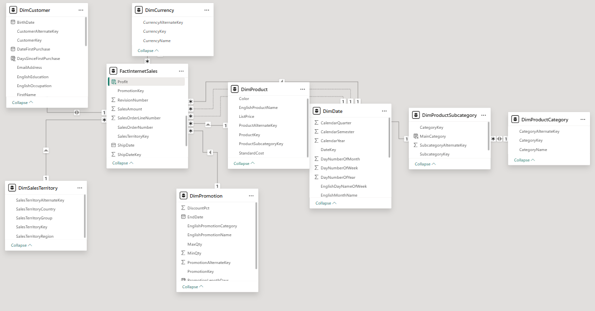

# AdventureWorks Sales Data Power BI Assignment

## Overview

This repository contains a Power BI project that explores AdventureWorks sales data to empower business decision-making. The project includes data modeling, relationship management, and calculated columns to provide meaningful business insights.

---

## Tasks Completed

- Connected to `AdventureWorks Sales Data.xIsx` and imported:
  - DimCurrency
  - DimCustomer
  - DimDate
  - DimProduct
  - DimPromotion
  - DimSalesTerritory
  - FactInternetSales

- Established relationships:
  - FactInternetSales[OrderDateKey] → DimDate[DateKey] (*:1, Single, Active)
  - FactInternetSales[DueDateKey] → DimDate[DateKey] (*:1, Single, Active)
  - FactInternetSales[ShipDateKey] → DimDate[DateKey] (*:1, Single, Active)

- Loaded additional tables from `AdventureWorks Product Categories.xlsx`:
  - DimProductCategory
  - DimProductSubcategory

- Managed relationships:
  - Deleted the default relationship between DimProductCategory and DimProductSubcategory
  - Created Many to One (*:1, Both) relationships:
    - DimProductSubcategory[CategoryKey] → DimProductCategory[CategoryKey]
    - DimProduct[ProductSubcategoryKey] → DimProductSubcategory[SubcategoryKey]

- Added calculated columns:
  - **IncomeStatus** (DimCustomer): Categorizes YearlyIncome
  - **DaysSinceFirstPurchase** (DimCustomer): Days since first purchase
  - **FullName** (DimCustomer): FirstName + LastName
  - **MaleFemale** (DimCustomer): Gender as Male/Female
  - **Relationship** (DimCustomer): MaritalStatus as Married/Single
  - **MainCategory** (DimProductSubcategory): Category name from DimProductCategory
  - **PromotionLengthDays** (DimPromotion): Days between StartDate and EndDate
  - **Profit** (FactInternetSales): UnitPrice minus ProductStandardCost, formatted as currency

---

## Data Model Screenshot

```markdown
## Data Model


```

---

## How to Use

- Clone this repository.
- Open the `.pbix` file in Power BI Desktop.
- Review the data model and calculated columns.
- Refer to the screenshot for understanding the relationships.

---

## License

This project is licensed under the MIT License.

## Author

- [Rahul Rajasekharan Menon](https://github.com/RahulRmCoder)

---
